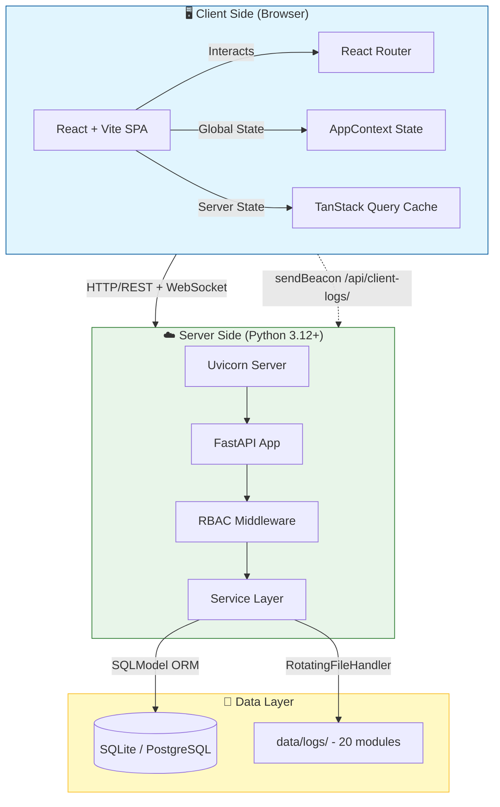
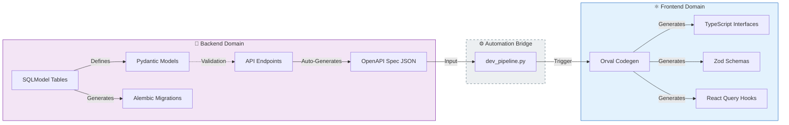

<div align="center">

# 🛒 Minimalist E-Commerce Platform

**A modern, lightweight e-commerce demo built for testing, demonstration, and AI-driven development.**

[](https://python.org)
[](https://fastapi.tiangolo.com)
[](https://react.dev)
[](https://typescriptlang.org)
[](https://vitejs.dev)
[](https://tailwindcss.com)
[](LICENSE)

<p align="center">
  <strong>Designed for rapid prototyping, AI pair-programming, and containerized deployments.</strong>
</p>

</div>

---

## ✨ Overview

A **Single Page Application (SPA)** e-commerce platform designed as a development playground. Built with modern technologies and clean architecture, this project serves as:

- 🧪 **Testing Ground** — Experiment with new features and integrations
- 🎓 **Learning Platform** — Understand full-stack development patterns
- 🤖 **AI-Driven Development** — Optimized for pair-programming with AI assistants
- 📦 **Container-Ready** — Designed for easy deployment to containerized environments

---

## 🟢 Guía de Inicio (Zero-to-Hero)

Sigue estos pasos estrictos para levantar el entorno sin errores.

#### Paso 1: Prerrequisitos del Sistema

Asegúrate de tener instalados:

1.  **Python 3.12+**:
    - **Windows (PowerShell Administrador)**:
      ```powershell
      Start-Process choco -ArgumentList "install python312 -y" -Verb RunAs
      ```
    - **Linux (Debian/Ubuntu)**:
      ```bash
      sudo apt update && sudo apt install python3.12 python3.12-venv python3.12-dev -y
      ```
    - _Verificar_: `python --version` (Debe decir 3.12.x o superior)
2.  **Node.js 20+ (LTS)**: [Descargar Oficial](https://nodejs.org/)
    - _Verificar_: `node -v`

#### Paso 2: Instalación Automática (El "Botón Mágico")

No necesitas crear entornos virtuales ni instalar dependencias manualmente. Hemos creado un script que orquesta todo.

```bash
git clone https://github.com/ancrz/ecommerce-playground.git
cd ecommerce-playground

# Ejecuta el Asistente de Setup
# (Crea .venv, instala Python deps, instala Node deps, migra DB y crea semillas)
python setup.py
```

> **Nota**: Si algo falla, puedes ejecutar `python setup.py --clean` para borrar todo y empezar de cero.

#### Paso 3: Operación Diaria

**☀️ Iniciar el Sistema:**

```bash
python start.local.py
# Frontend: http://localhost:5173 (or FRONTEND_PORT)
# API Docs: http://localhost:8042/docs (or BACKEND_PORT)
```

_El script detectará puertos ocupados y limpiará procesos "zombies" automáticamente._

**🌑 Detener el Sistema:**

```bash
python stop.local.py
```

_Detiene backend y frontend de forma segura y limpia logs antiguos._

**🔄 Ciclo de Desarrollo (Pipeline):**
Si cambias algo en el Backend (Modelos, API), ejecuta esto para actualizar el Frontend automáticamente:

```bash
python scripts/dev_pipeline.py
# Opciones: --soft (default), --hard (reset DB), --front (solo cliente), --back (restart backend)
```

---

## 🏗️ Architecture & DNA

Este proyecto utiliza una arquitectura **Schema-Driven** estricta para garantizar que el Backend y el Frontend estén siempre sincronizados.

### 💾 Unified Database Architecture (v3.0)

Arquitectura de base de datos **Unificada y Agnóstica** con soporte dual.

*   **Motor**: Soporte nativo para **PostgreSQL** (Producción) y **SQLite** (Dev).
*   **ORM Moderno**: **SQLModel** (Pydantic v2 + SQLAlchemy 2.0) como verdad única del esquema.
*   **Migraciones Automáticas**: `Alembic` detecta cambios en los modelos Python y actualiza la DB.

**Para sincronizar cambios en la BD:**
```bash
python scripts/dev_pipeline.py --migrate
```

### 🗺️ System Map (Dependency Graph)



### 🧬 Schema-Driven Development (Information Flow)

No escribimos tipos manualmente en el Frontend; se _infieren_ y _generan_ desde el Backend.

**Flujo de la Verdad (Source of Truth Flow):**

1.  **Backend (Pydantic/SQLModel)**: Define la estructura de datos.
2.  **Alembic**: Migra la estructura a SQL (Dependencia Vertical).
3.  **OpenAPI**: Expone la estructura como contrato (Interfaz Abstracta).
4.  **Orval**: Ingiere el contrato y genera código TypeScript, Hooks y Validadores Zod (Dependencia Horizontal).



---

## 🛠️ Tech Stack

### Backend Core

| Category | Technology |
|----------|-----------|
| **Runtime** | Python 3.12+ |
| **Framework** | FastAPI (Async) |
| **ORM** | SQLModel (Pydantic v2 + SQLAlchemy 2.0) |
| **Migrations** | Alembic |
| **Server** | Uvicorn |
| **Auth** | JWT (PyJWT) + PBKDF2-SHA256 |
| **Linter** | Ruff |

### Frontend Ecosystem

| Category | Technology |
|----------|-----------|
| **Framework** | React 18 + Vite 7 |
| **Language** | TypeScript 5.9 |
| **Data Fetching** | TanStack Query v5 (React Query) |
| **Auto-Gen** | Orval 7 (OpenAPI to Code) |
| **Validation** | Zod |
| **Styling** | Tailwind CSS v4 |
| **HTTP Client** | Axios |
| **Icons** | Lucide React |
| **Formatter** | Prettier |

### Infrastructure

| Category | Technology |
|----------|-----------|
| **Database** | SQLite (Dev) / PostgreSQL 15 (Prod) |
| **Containers** | Docker + Docker Compose |
| **Logging** | Python stdlib logging + RotatingFileHandler |

---

## 📁 Project Structure

```bash
ecommerce-playground/
├── backend/                     # FastAPI Backend
│   ├── api/                     # REST API Routers (15 routers)
│   ├── services/                # Business Logic Layer (14 services)
│   ├── models/                  # SQLModel Tables + Pydantic DTOs
│   ├── core/                    # Config, i18n, Exception Handlers
│   ├── database/                # DatabaseManager (SQLite/PostgreSQL)
│   ├── templates/               # HTML Templates (invoices)
│   └── utils/                   # Auth, Logging, Dependencies
├── frontend/                    # React SPA
│   └── src/
│       ├── api/generated/       # Orval Generated Hooks (per tag)
│       ├── admin-modules/       # Lazy-loaded Admin Modules
│       ├── components/          # React Components
│       ├── context/             # WebSocket Provider
│       ├── hooks/               # Custom Hooks
│       ├── layouts/             # Page Layouts
│       ├── pages/               # Route Pages
│       └── lib/                 # Query Client, Utilities
├── alembic/                     # Database Migrations
├── scripts/                     # DevOps Automation (20+ scripts)
├── data/                        # Runtime Data
│   ├── database/                # SQLite DB Files
│   ├── logs/                    # Granular Module Logs (20 files)
│   └── uploads/                 # User Uploads (products, logos)
├── setup.py                     # One-command Setup
├── start.local.py               # Intelligent Startup
├── stop.local.py                # Graceful Shutdown
└── docker-compose.yml           # PostgreSQL (Production)
```

---

## 🌟 Current System Status

### 🏢 Core Modules (Admin Panel)

| Module | Description |
|--------|-------------|
| **Dashboard** | Real-time metrics and KPIs |
| **POS (Point of Sale)** | Cart management, checkout, payment processing |
| **Products** | CRUD with multi-image support (up to 5), sliders, categories |
| **Sales & Orders** | Sale completion, daily reports, end-of-day closure |
| **Finance** | Multi-currency engine with exchange rates and IGTF calculation |
| **Tax Management** | Dynamic regional tax rules (multi-rate per region) |
| **Billing** | PDF invoice generation with business branding |
| **User Management** | RBAC with dynamic roles and Unix-style permissions |
| **Theme** | Dynamic theming (colors, fonts, CSS) via admin panel |
| **Content** | Content management for storefront |

### 🔐 Security & RBAC

- **Authentication**: JWT tokens with configurable expiration
- **Password Hashing**: PBKDF2-SHA256 (100,000 iterations, random salt)
- **Dynamic RBAC**: Unix-style permissions per module (READ=4, WRITE=2, EXECUTE=1)
- **Password Recovery**: 6-digit email verification codes with 15-minute expiration
- **Soft Delete**: Users are deactivated, not removed

### 👁️ Observability & Logging

- **Backend Logging**: 20 granular log files in `data/logs/` with per-module RotatingFileHandler (5MB, 3 backups)
- **Client Logging**: Frontend monkey-patches `console.*` and sends logs via `navigator.sendBeacon()` to `/api/client-logs/`
- **WebSocket**: Real-time stock updates with auto-reconnect
- **Log Rotation**: Automatic rotation at 5MB + session-based rotation on startup
- **Health Checks**: `GET /api/health` for service status

**Log files by domain:**

```
data/logs/
├── auth.log          # Authentication, RBAC, JWT
├── products.log      # Product CRUD, stock
├── images.log        # Image processing, uploads
├── cart.log          # Cart operations, tax calc
├── sales.log         # Sales, daily reports
├── finance.log       # Currency, exchange rates
├── billing.log       # Invoices, PDF generation
├── tax.log           # Regional tax rules
├── user.log          # User admin operations
├── roles.log         # Role management
├── business.log      # Business info
├── customization.log # Theme settings
├── database.log      # DB operations
├── websocket.log     # WS connections
├── webhook.log       # External webhooks
├── email.log         # SMTP operations
├── client.log        # Frontend console logs
├── dashboard.log     # Dashboard queries
└── app.log           # Startup, shutdown, errors
```

---

## 🔧 Configuration

Managed via `.env` file (copy from `.env.example`):

```env
# ===== Base de Datos =====
DB_TYPE=sqlite              # sqlite | postgres
DB_PATH=./data/database

# PostgreSQL (solo si DB_TYPE=postgres)
DB_HOST=localhost
DB_PORT=5432
DB_USER=admin
DB_PASS=admin2024
DB_NAME=ecommerce_unified

# ===== Servidores =====
BACKEND_PORT=8042
BACKEND_URL=http://localhost:8042
FRONTEND_PORT=5173

# ===== Credenciales Admin =====
ADMIN_USERNAME=admin
ADMIN_PASSWORD=admin2024

# ===== JWT =====
JWT_SECRET_KEY=your-secret-key
JWT_ALGORITHM=HS256
JWT_EXPIRATION_HOURS=24

# ===== Logging =====
# Opciones: DEBUG, INFO, WARNING, ERROR, CRITICAL
LOG_LEVEL=INFO

# ===== Servicios Externos (Opcional) =====
SMTP_HOST=smtp.example.com
SMTP_PORT=587
SMTP_USER=no-reply@example.com
SMTP_PASSWORD=changeme
SMTP_FROM_EMAIL=no-reply@example.com
HCAPTCHA_SECRET_KEY=           # dejar vacio omite validacion

# ===== Feature Flags =====
DEBUG=true
ENABLE_DOCS=true
```

---

## 👤 Usuarios por Defecto (Seed Data)

El script `seed_data.py` (ejecutado automaticamente por `setup.py`) crea los siguientes usuarios:

### Administrador

| Campo | Valor |
|-------|-------|
| **Username** | `admin` (configurable via `ADMIN_USERNAME`) |
| **Password** | `admin2024` (configurable via `ADMIN_PASSWORD`) |
| **Email** | `admin@e-commerce.local` |
| **Rol** | `admin` (acceso total) |

### Usuarios de Prueba

Todos usan password: `password123` (configurable via `DUMMY_USER_PASSWORD`)

| Username | Rol | Acceso Principal |
|----------|-----|------------------|
| `products_manager` | products_manager | Productos, Imagenes |
| `sales_manager` | sales_manager | POS, Ventas, Reportes |
| `finance_manager` | finance_manager | Monedas, Impuestos, Facturacion |
| `content_manager` | content_manager | Contenido, Personalizacion |

### Datos Semilla Adicionales

El seed tambien crea:
- **2 Monedas**: USD (base) + VES (con tasa de cambio)
- **1 Region Fiscal**: Venezuela (IVA 16%, IGTF 3%)
- **5 Productos**: Con stock, precios y categorias de ejemplo

---

## 🛒 Flujo de Compra (Guest Purchase Flow)

El sistema soporta compras **sin autenticacion** (modo invitado). Este es el flujo principal del MVP:

```
1. Cliente crea carrito    →  POST /api/cart/guest?region_id=X&currency_id=Y
                               Retorna: cart_id, customer_id = "guest-{uuid}"

2. Agrega productos        →  POST /api/cart/{cart_id}/items
                               Body: { "product_id": "...", "quantity": 2 }
                               Retorna: Cart con subtotal + impuestos recalculados

3. Consulta carrito         →  GET /api/cart/{cart_id}
                               Retorna: items, subtotal, tax_amount, igtf_amount, total_with_tax

4. Staff completa venta     →  POST /api/sales/{cart_id}/complete  (requiere JWT)
                               Body: { "payment_method": "cash", "amount_given": 100.00 }
                               Retorna: Sale ID, stock descontado automaticamente

5. (Opcional) Genera QR     →  GET /api/cart/{cart_id}/qr
                               Retorna: data:image/png;base64 del codigo QR
```

**Notas:**
- Los impuestos se calculan automaticamente segun `region_id` y `currency_id`
- IGTF solo aplica en monedas no-base (ej: USD en Venezuela)
- Si el cliente hace login, su carrito invitado se reasigna via `POST /api/cart/{cart_id}/assign`

---

## 📡 API Reference

La documentacion interactiva completa esta disponible en:
- **Swagger UI**: `http://localhost:8042/docs`
- **ReDoc**: `http://localhost:8042/redoc`

### Resumen de Endpoints por Router

| Router | Prefijo | Endpoints | Auth |
|--------|---------|-----------|------|
| **Auth** | `/api/auth` | login, logout, me, refresh, change-password, recover | Publico (login) / JWT |
| **Products** | `/api/products` | CRUD, search, by-category | Publico (GET) / JWT (write) |
| **Images** | `/api/images` | upload, list, delete, reorder | JWT |
| **Cart** | `/api/cart` | guest, create, items CRUD, QR, assign | Publico (guest) / JWT |
| **Sales** | `/api/sales` | complete, cancel, daily report, close-day | JWT (sales_manager) |
| **Finance** | `/api/finance` | currencies CRUD, exchange rates | JWT (finance_manager) |
| **Tax Admin** | `/api/admin/tax` | regions, rates CRUD | JWT (finance_manager) |
| **Billing** | `/api/billing` | customer search, invoices, PDF gen | JWT |
| **Users** | `/api/admin/users` | CRUD, activate/deactivate | JWT (admin) |
| **Roles** | `/api/admin/roles` | CRUD, permissions | JWT (admin) |
| **Dashboard** | `/api/admin/dashboard` | stats, metrics, recent activity | JWT |
| **Business** | `/api/business` | info (singleton), logo upload | JWT (admin) |
| **Customization** | `/api/admin/customization` | theme, colors, fonts, CSS | JWT (admin) |
| **WebSocket** | `/api/ws` | events (stock updates, notifications) | Token param |
| **Client Logs** | `/api/client-logs` | beacon receiver | Publico |

---

## 🧰 Scripts de Utilidad

Todos los scripts estan en `scripts/` y se ejecutan con Python del sistema (no requieren `.venv`):

### Operaciones Principales

| Script | Descripcion |
|--------|-------------|
| `dev_pipeline.py` | Pipeline completo: lint, migrate, export OpenAPI, codegen Orval |
| `seed_data.py` | Siembra idempotente: usuarios, monedas, impuestos, productos |
| `seed_dummies.py` | Genera datos ficticios masivos para stress testing |
| `migrate.py` | Ejecuta migraciones Alembic pendientes |

### Base de Datos

| Script | Descripcion |
|--------|-------------|
| `db_audit.py` | Auditoria: WAL mode, integrity check, indices, conteo de registros |
| `inspect_db.py` | Inspector interactivo de tablas y contenido |
| `backup.sqlite.py` | Backup con timestamp a `data/backups/` |
| `restore.sqlite.py` | Restaura desde backup |
| `regenerate.py` | Regenera esquema completo (destructivo) |

### Diagnostico y Testing

| Script | Descripcion |
|--------|-------------|
| `status.py` | Estado del sistema: puertos, procesos, DB, logs |
| `verify_auth.py` | Verifica auth: login, JWT, RBAC por rol |
| `test_services.py` | Tests de servicios individuales |
| `test_websocket.py` | Test de conexion WebSocket |
| `stress_test.py` | Stress test con peticiones concurrentes |

### Otros

| Script | Descripcion |
|--------|-------------|
| `export_openapi.py` | Exporta spec OpenAPI a JSON (para Orval) |
| `watch.py` | File watcher para hot-reload manual |
| `run.py` | Arranque alternativo del servidor |
| `restart.py` | Reinicio rapido del backend |
| `migrate_rbac.py` | Migracion especifica de permisos RBAC |

---

## 🐳 Docker

El archivo `docker-compose.yml` provee **PostgreSQL para produccion**, no containeriza la aplicacion:

```bash
# Levantar PostgreSQL
docker compose up -d

# Cambiar a PostgreSQL en .env
DB_TYPE=postgres
DB_HOST=localhost
DB_PORT=5432
```

Para desarrollo local, SQLite es el motor por defecto (cero configuracion).

---

## 🗄️ Database Schema

### Tablas Principales

| Tabla | Descripcion |
|-------|-------------|
| `users` | Usuarios del sistema con RBAC |
| `roles` | Roles dinamicos con permisos Unix-style |
| `products` | Catalogo de productos con stock y precios |
| `product_images` | Imagenes multiples por producto (max 5) |
| `categories` | Categorias de productos |
| `carts` | Carritos con items JSON, totales e impuestos |
| `sales` | Ventas completadas con historial de pago |
| `currencies` | Monedas con tasas de cambio |
| `tax_regions` | Regiones fiscales |
| `tax_rates` | Tasas impositivas por region (IVA, IGTF) |
| `invoices` | Facturas generadas (PDF) |
| `business_info` | Informacion del negocio (singleton) |
| `customization` | Configuracion visual del tema |
| `password_recovery` | Codigos de recuperacion temporales |
| `sessions` | Sesiones JWT activas |

---

## 📄 License

Apache License 2.0 — see [LICENSE](LICENSE) for details.

<div align="center">

**Built with ❤️ for learning, testing, and AI-assisted development.**

[⬆ Back to Top](#-minimalist-e-commerce-platform)

</div>
