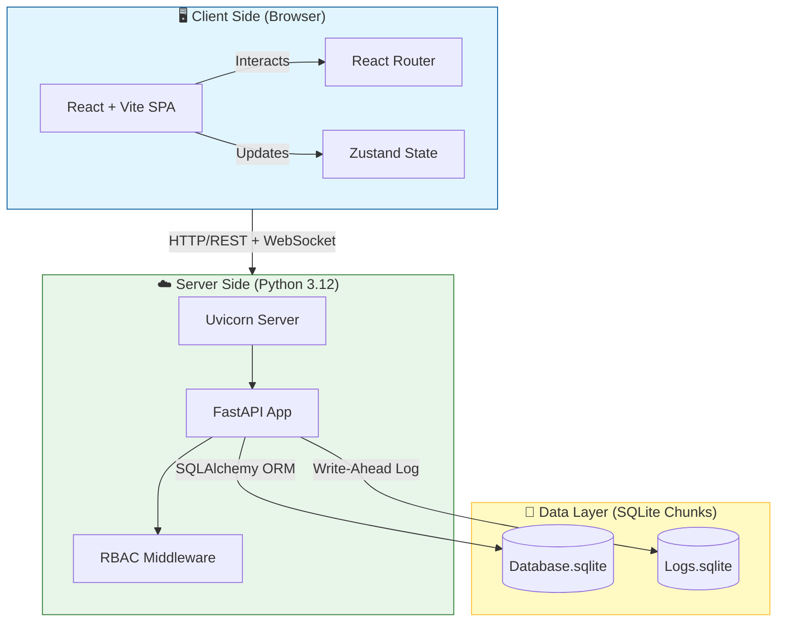
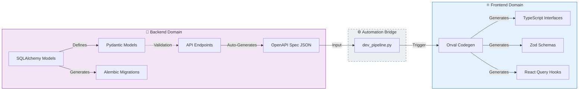

<div align="center">

# 🛒 Minimalist E-Commerce Platform

**A modern, lightweight e-commerce demo built for testing, demonstration, and AI-driven development.**

[](https://python.org)
[](https://fastapi.tiangolo.com)
[](https://react.dev)
[](https://typescriptlang.org)
[](https://vitejs.dev)
[](LICENSE)

<p align="center">
  <strong>Designed for rapid prototyping, AI pair-programming, and containerized deployments.</strong>
</p>

</div>

---

## ✨ Overview

A **Single Page Application (SPA)** e-commerce platform designed as a development playground. Built with modern technologies and clean architecture, this project serves as:

- 🧪 **Testing Ground** — Experiment with new features and integrations
- 🎓 **Learning Platform** — Understand full-stack development patterns
- 🤖 **AI-Driven Development** — Optimized for pair-programming with AI assistants
- 📦 **Container-Ready** — Designed for easy deployment to containerized environments

---

## 🟢 Guía de Inicio (Zero-to-Hero)

Sigue estos pasos estrictos para levantar el entorno sin errores.

#### Paso 1: Prerrequisitos del Sistema

Asegúrate de tener instalados:

1.  **Python 3.12+**: [Descargar Oficial](https://www.python.org/downloads/)
    - ⚠️ **Importante**: Marcar `Add Python to PATH` durante instalación.
    - _Verificar_: `python --version` (Debe decir 3.12.x)
2.  **Node.js 20+ (LTS)**: [Descargar Oficial](https://nodejs.org/)
    - _Verificar_: `node -v`

#### Paso 2: Instalación Automática (El "Botón Mágico")

No necesitas crear entornos virtuales ni instalar dependencias manualmente. Hemos creado un script que orquesta todo.

```bash
git clone https://github.com/ancrz/ecommerce-playground.git
cd ecommerce-playground

# Ejecuta el Asistente de Setup
# (Crea .venv, instala Python deps, instala Node deps, migra DB y crea semillas)
python setup.py
```

> **Nota**: Si algo falla, puedes ejecutar `python setup.py --clean` para borrar todo y empezar de cero.

#### Paso 3: Operación Diaria

**☀️ Iniciar el Sistema:**

```bash
python start.local.py
# Frontend: http://localhost:5173
# API Docs: http://localhost:8042/docs
```

_El script detectará puertos ocupados y limpiará procesos "zombies" automáticamente._

**🌑 Detener el Sistema:**

```bash
python stop.local.py
```

_Detiene backend y frontend de forma segura y limpia logs antiguos._

**🔄 Ciclo de Desarrollo (Pipeline):**
Si cambias algo en el Backend (Modelos, API), ejecuta esto para actualizar el Frontend automáticamente:

```bash
python scripts/dev_pipeline.py
# Regenera types.ts, hooks y validadores Zod
```

---

## 🏗️ Architecture & DNA

Este proyecto utiliza una arquitectura **Schema-Driven** estricta para garantizar que el Backend y el Frontend estén siempre sincronizados (Interdependencia Sincrónica).

### 🗺️ System Map (Dependency Graph)

Gráfico de alto nivel que muestra las dependencias de ejecución y almacenamiento.



### 🧬 Schema-Driven Development (Information Flow)

Aquí reside la **magia de la automatización**. No escribimos tipos manualmente en el Frontend; se _infieren_ y _generan_ desde el Backend.

**Flujo de la Verdad (Source of Truth Flow):**

1.  **Backend (Pydantic)**: Define la estructura de datos.
2.  **Alembic**: Migra la estructura a SQL (Dependencia Vertical).
3.  **OpenAPI**: Expone la estructura como contrato (Interfaz Abstracta).
4.  **Orval**: Ingiere el contrato y genera código TypeScript, Hooks y Validadores Zod (Dependencia Horizontal).



## 🛠️ Tech Stack

### Backend Core

- **Runtime**: Python 3.12 (Strict)
- **Framework**: FastAPI (Async)
- **Data Integrity**: Pydantic v2
- **ORM**: SQLAlchemy 2.0
- **Migrations**: Alembic
- **Server**: Uvicorn

### Frontend Ecosystem

- **Framework**: React 18 + Vite
- **Language**: TypeScript 5
- **Data Fetching**: TanStack Query (React Query)
- **Auto-Gen**: Orval (OpenAPI to Code)
- **Validation**: Zod (Schema mirroring)
- **Styling**: TailwindCSS

---

## 📁 Project Structure

```bash
ecommerce-playground/
├── backend/                 # FastAPI Backend (Python 3.12)
│   ├── api/                 # REST API Routers
│   ├── services/            # Business Logic Layer
│   ├── core/                # Config & Security
│   └── database/            # Database Manager
├── frontend/                # React SPA
│   └── src/
│       ├── api.generated.ts   # Orval Generated Client
│       ├── hooks.generated.ts # Generated React Query Hooks
│       ├── types.generated.ts # Inferred TS Interfaces
│       ├── schemas/           # Zod Validation Schemas (Modular)
│       └── components/        # React Components
├── scripts/                 # DevOps Automation (Start, Stop, Pipeline)
└── data/                    # Runtime Data (SQLite DBs, Logs, Uploads)
```

---

## 🌟 Current System Status

### 🏢 Core Modules (Admin Panel)

- **Finance (SAP-like):** Multi-currency engine.
- **Tax Management:** Dynamic regional tax rules.
- **User Management (RBAC):** Granular permissions.
- **Product Catalogue:** Currency-aware pricing & inventory.

### 👁️ Observability & Logging

- **Centralized Logging:** `data/logs/` unified storage.
- **Remote Client Logging:** Captures console errors via WebSocket/API.
- **Log Rotation:** Automated session-based rotation.

---

## 🔧 Configuration

managed via `.env` file:

```env
# Database
DB_TYPE=sqlite
DB_PATH=./data/database

# Servers
BACKEND_PORT=8042
FRONTEND_PORT=5173
```

---

## 📄 License

Apache License 2.0 — see [LICENSE](LICENSE) for details.

<div align="center">

**Built with ❤️ for learning, testing, and AI-assisted development.**

[⬆ Back to Top](#-minimalist-e-commerce-platform)

</div>
