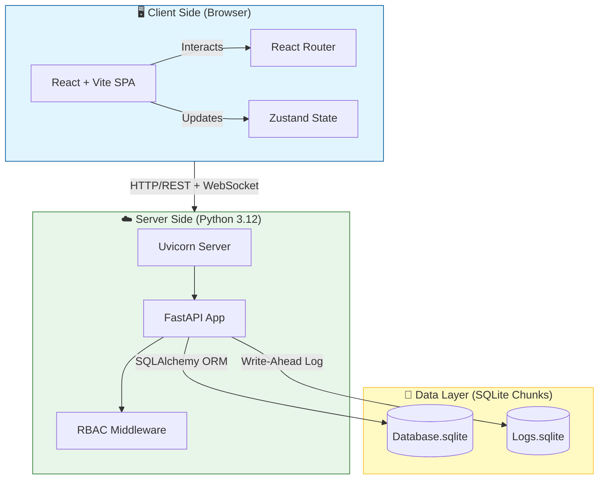

<div align="center">

# 🛒 Minimalist E-Commerce Platform

**A modern, lightweight e-commerce demo built for testing, demonstration, and AI-driven development.**

[](https://python.org)
[](https://fastapi.tiangolo.com)
[](https://react.dev)
[](https://typescriptlang.org)
[](https://vitejs.dev)
[](LICENSE)

<p align="center">
  <strong>Designed for rapid prototyping, AI pair-programming, and containerized deployments.</strong>
</p>

</div>

---

## ✨ Overview

A **Single Page Application (SPA)** e-commerce platform designed as a development playground. Built with modern technologies and clean architecture, this project serves as:

- 🧪 **Testing Ground** — Experiment with new features and integrations
- 🎓 **Learning Platform** — Understand full-stack development patterns
- 🤖 **AI-Driven Development** — Optimized for pair-programming with AI assistants
- 📦 **Container-Ready** — Designed for easy deployment to containerized environments

---

## 🏗️ Tech Stack

<table>
<tr>
<td width="50%">

### Backend

| Technology      | Purpose                              |
| --------------- | ------------------------------------ |
| **FastAPI**     | High-performance async API framework |
| **Pydantic v2** | Data validation & serialization      |
| **SQLAlchemy**  | ORM (Relational Mapping)             |
| **Alembic**     | Database migrations                  |
| **PyJWT**       | Authentication & RBAC                |
| **aiosqlite**   | Async database driver                |

</td>
<td width="50%">

### Frontend

| Technology       | Purpose                   |
| ---------------- | ------------------------- |
| **React 18**     | UI component library      |
| **TypeScript**   | Type-safe development     |
| **Vite**         | Lightning-fast build tool |
| **React Query**  | State & Cache Management  |
| **Zod**          | Runtime schema validation |
| **Lucide React** | Modern icon library       |

</td>
</tr>
</table>

---

## 🚀 Quick Start

### Prerequisites

- **Python 3.12** (Recomendado/Testeado).
  - _Nota: Python 3.11 es el mínimo soportado, pero el entorno de desarrollo usa 3.12._
- **Node.js 18+** con npm
- **Git**

### Guía de Instalación (Entorno Estable)

Sigue estos pasos para garantizar un entorno libre de errores:

1. **Instalar Python 3.12**: [Descargar aquí](https://www.python.org/downloads/).
   - _Asegúrate de marcar "Add Python to PATH" durante la instalación._

2. **Clonar y Setup**:

   ```bash
   git clone https://github.com/ancrz/ecommerce-playground.git
   cd ecommerce-playground

   # Setup Inteligente (Crea venv, instala deps, migra DB)
   python setup.py
   ```

### Start Development Servers

```bash
# Start both backend and frontend
python start.local.py

# Access the application
# Frontend → http://localhost:5173
# Backend API → http://localhost:8042/docs
```

### Stop Servers

```bash
python stop.local.py
```

### Scripts Overview

| Script            | Purpose                                        |
| ----------------- | ---------------------------------------------- |
| `setup.py`        | Initialize venv, install deps, run migrations  |
| `start.local.py`  | Start backend + frontend servers               |
| `stop.local.py`   | Stop all servers (idempotent)                  |
| `deploy_stack.py` | Full orchestration: setup → migrations → start |

---

## 🏗️ Architecture & DNA

Este proyecto utiliza una arquitectura **Schema-Driven** estricta para garantizar que el Backend y el Frontend estén siempre sincronizados (Interdependencia Sincrónica).

### �️ System Map (Dependency Graph)

Gráfico de alto nivel que muestra las dependencias de ejecución y almacenamiento.



### 🧬 Schema-Driven Development (Information Flow)

Aquí reside la **magia de la automatización**. No escribimos tipos manualmente en el Frontend; se _infieren_ y _generan_ desde el Backend.

**Flujo de la Verdad (Source of Truth Flow):**

1.  **Backend (Pydantic)**: Define la estructura de datos.
2.  **Alembic**: Migra la estructura a SQL (Dependencia Vertical).
3.  **OpenAPI**: Expone la estructura como contrato (Interfaz Abstracta).
4.  **Orval**: Ingiere el contrato y genera código TypeScript, Hooks y Validadores Zod (Dependencia Horizontal).

```mermaid
flowchart LR
    %% Nodos del Backend
    subgraph Backend_World ["🐍 Backend Domain"]
        PY[Pydantic Models]
        SQL[SQLAlchemy Models]
        AL[Alembic Migrations]
        OAPI[OpenAPI Spec (JSON)]

        PY -.->|Validation| API_EP[API Endpoints]
        SQL -->|Defines| PY
        SQL -->|Generates| AL
        API_EP -->|Auto-Generates| OAPI
    end

    %% Pipeline de Automatización
    subgraph Bridge ["⚙️ Automation Bridge"]
        PL[dev_pipeline.py]
    end

    %% Nodos del Frontend
    subgraph Frontend_World ["⚛️ Frontend Domain"]
        ORVAL[Orval Codegen]
        TS[TypeScript Interfaces]
        ZOD[Zod Schemas]
        HOOKS[React Query Hooks]

        ORVAL -->|Generates| TS
        ORVAL -->|Generates| ZOD
        ORVAL -->|Generates| HOOKS
    end

    %% Relaciones Cross-Domain
    OAPI -->|Input| PL
    PL -->|Trigger| ORVAL

    %% Estilos
    style Backend_World fill:#f3e5f5,stroke:#7b1fa2
    style Bridge fill:#eceff1,stroke:#546e7a,stroke-dasharray: 5 5
    style Frontend_World fill:#e3f2fd,stroke:#1565c0
```

## 🛠️ Tech Stack

### Backend Core

- **Runtime**: Python 3.12 (Strict)
- **Framework**: FastAPI (Async)
- **Data Integrity**: Pydantic v2
- **ORM**: SQLAlchemy 2.0
- **Migrations**: Alembic
- **Server**: Uvicorn

### Frontend Ecosystem

- **Framework**: React 18 + Vite
- **Language**: TypeScript 5
- **Data Fetching**: TanStack Query (React Query)
- **Auto-Gen**: Orval (OpenAPI to Code)
- **Validation**: Zod (Schema mirroring)
- **Styling**: TailwindCSS

---

## �📁 Project Structure

```
ecommerce-playground/
├── backend/                 # FastAPI Backend
│   ├── api/                 # REST API Endpoints
│   ├── services/            # Business Logic Layer
│   ├── models/              # Pydantic DTOs & Schemas
│   ├── database/            # Database Manager
│   └── utils/               # Auth & Helpers
├── frontend/                # React SPA
│   └── src/
│       ├── schemas.ts       # Zod Validation Schemas
│       ├── types.ts       # TypeScript Types (inferred)
│       ├── api.ts           # API Client with validation
│       └── components/      # React Components
├── scripts/                 # Utility Scripts
├── docs/                    # Architecture Documentation
├── data/                    # Runtime Data (SQLite, uploads)
├── pyproject.toml           # Python Project Config
└── alembic.ini              # Database Migrations
```

---

## 🔑 Key Features

## 🌟 Current System Status

### 🏢 Core Modules (Admin Panel)

- **Finance (SAP-like):** Multi-currency engine with "Base Currency" logic and real-time exchange rate conversion.
- **Tax Management:** Dynamic regional tax rules (States, Cities) and cumulative tax rate calculations.
- **User Management (RBAC):** Granular Role-Based Access Control enforcing specific permissions for Admins and Managers.
- **Product Catalogue:** Currency-aware pricing, inventory management, and image handling.

### 👁️ Observability & Logging

- **Centralized Logging:** Unified storage in `data/logs/` for both Backend and Frontend events.
- **Remote Client Logging:** Captures browser errors and `console.log` and ships them to the backend for analysis.
- **Log Rotation:** Automated session-based log rotation with timestamps.

### ⚡ Modern Architecture

- **Sync Engine:** `scripts/regenerate.py` automatically synchronizes Backend OpenAPI schemas with Frontend Zod types and TypeScript interfaces.
- **State Management:** Powered by **React Query** for automatic cache invalidation and data freshness.
- **UI/UX:** Glassmorphism design system using TailwindCSS (Backdrop Blur modals).

---

## 🔧 Configuration

All settings are managed via `.env` file:

```env
# Database
DB_TYPE=sqlite
DB_PATH=./data/database

# Servers
BACKEND_PORT=8000
FRONTEND_PORT=5173

# Admin (change in production!)
ADMIN_USERNAME=admin
ADMIN_PASSWORD=admin2024

# Security
JWT_SECRET_KEY=your-generated-secret
```

---

## 🤖 AI-Driven Development

This project is optimized for **AI pair-programming**:

| Feature                | Benefit                                    |
| ---------------------- | ------------------------------------------ |
| **Clean Architecture** | Easy for AI to understand and navigate     |
| **Type Safety**        | Pydantic + Zod ensure contract consistency |
| **Modular Design**     | Changes are isolated and predictable       |
| **Documentation**      | Maps and guides for quick context          |
| **Script-Based Setup** | One command to initialize everything       |

### Development Philosophy

1. **Contract-First** — Backend DTOs (Pydantic) mirror Frontend schemas (Zod)
2. **Validation Everywhere** — Runtime validation on both ends
3. **Clean Separation** — API → Service → Database layers
4. **RBAC Security** — Role-based guards on all admin endpoints

---

## 📖 Documentation

| Document                             | Description                         |
| ------------------------------------ | ----------------------------------- |
| [Backend Map](docs/backend_map.md)   | Service architecture & dependencies |
| [Frontend Map](docs/frontend_map.md) | Component hierarchy & data flow     |
| [Global Map](docs/global_map.md)     | Full-stack integration guide        |

---

## 🚢 Container-Ready

This project is designed for easy containerization:

```bash
# Future: Docker deployment
docker-compose up -d
```

_Note: Docker support is planned for future iterations._

---

## 📄 License

Apache License 2.0 — see [LICENSE](LICENSE) for details.

---

<div align="center">

**Built with ❤️ for learning, testing, and AI-assisted development.**

[⬆ Back to Top](#-minimalist-e-commerce-platform)

</div>
